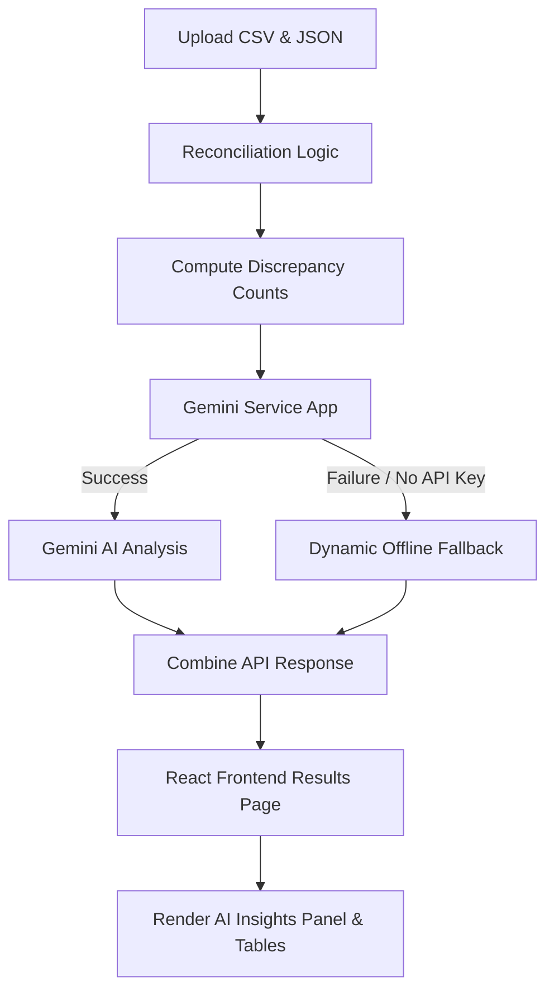

# Gemini AI Insights Integration Report

This report outlines the implementation details and architecture for the Gemini AI Insights module (Phase 4) integrated into the **IM-07 Inventory Reconciliation Tool**.

---

## 1. Architectural Overview

The integration establishes an AI-powered IT audit layer. When inventory comparison completes, metrics are analyzed by Gemini to generate root cause analysis, risk assessments, and actionable recommendations.

---

## 2. Backend Implementation Details

### Configuration & Key Management
- Environment variables are managed using `python-dotenv`.
- Variable injection occurs during application startup in `backend/app/main.py` calling `load_dotenv()`.
- API keys are expected to be configured under `GEMINI_API_KEY` in `backend/.env`. A template is provided in `backend/.env.example`.

### Service Layer (`backend/app/services/gemini_service.py`)
- Employs the `google-generativeai` SDK.
- Queries the `gemini-1.5-flash` model utilizing a strict JSON schema.
- Built-in exception handling captures network drops, invalid keys, or malformed API responses.

### Robust Fallback System
If Gemini is unavailable, a dynamic local fallback rule set analyzes the inventory discrepancy counts and generates structured insights:
- **Low Risk** (0 discrepancies): Assesses registry as healthy and aligned.
- **Medium Risk** (1-5 discrepancies): Flags standard lag synchronization.
- **High Risk** (>5 discrepancies): Flags change management pipeline breakdowns (e.g. unauthorized instances, orphan records).

---

## 3. Frontend Implementation Details

### Interactive AI Insights Panel (`frontend/src/pages/Results.jsx`)
- Rendered prominently at the top of the Results screen to deliver immediate executive takeaways.
- Visual elements are fully styled using the existing Slate/Inter design system and HSL colors:
  - **Risk Level Visual Badging**:
    - **Low Risk**: Highlighted in Green (`var(--color-success)`)
    - **Medium Risk**: Highlighted in Orange (`var(--color-extra)`)
    - **High Risk**: Highlighted in Red (`var(--color-missing)`)
  - **Grid Layout**: Features a responsive grid displaying the Risk Assessment & Executive Summary on the left, and the Root Cause Analysis & Recommended Mitigation list on the right.

### State Persistence
- All insights are returned under the `gemini_analysis` key of the main reconciliation payload.
- Fully compatible with the pre-existing `localStorage` mechanism (stored under `im_07_analysis_result`), ensuring full persistence when users refresh or return to the results screen.
- A client-side JavaScript mirroring fallback handles cases where old scan logs stored in local storage are reloaded.

---

## 4. Verification and QA Results

- **Python Unit Verification**: Created a custom check runner `verify_backend.py` to validate fallback rules across all risk states. All test checks passed successfully.
- **Vite Compilation Check (`npm run build`)**: **SUCCESS** (Bundles assets without warnings or errors).
- **ESLint Code Quality Check (`npm run lint`)**: **SUCCESS** (Clean report with zero lint errors or warnings).
